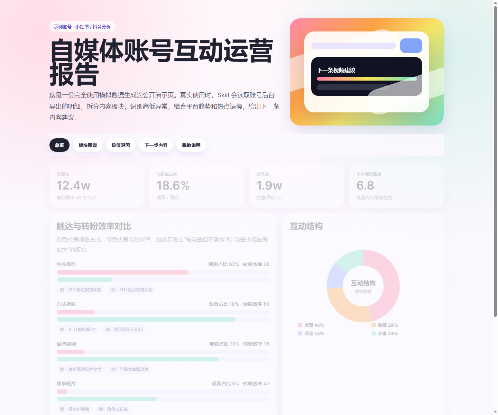
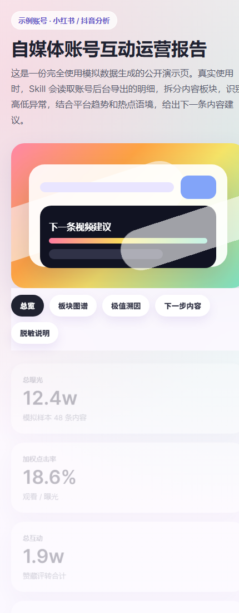

# Social Media Account Analyst Skill

一个面向中文自媒体运营的 Codex Skill：把小红书、抖音后台导出的账号数据，变成能直接指导下一条内容怎么做的运营报告和互动策略看板。



## 它能做什么

这个 Skill 会读取小红书笔记列表、抖音创作者中心等导出的 CSV/XLSX 数据，统一字段口径，计算曝光、观看、点击率、互动、收藏/点赞比、转粉效率等指标；再把账号内容拆成不同板块，识别爆款、低值内容、隐藏高转粉内容和异常样本，并结合当下平台热点、行业趋势与账号定位，输出下一条视频/笔记的选题、标题方向、封面钩子、开头 3 秒、内容结构、CTA 和验证指标。默认产出 Markdown 决策报告、JSON 分析摘要和多巴胺扁平风格 HTML 看板。

## 为什么有用

很多账号复盘只看播放量，结果会误判：有些内容很能破圈但不涨粉，有些内容播放不大却能带来精准关注和商业信任。这个 Skill 的核心价值是把“数据表”翻译成“运营决策”：哪些板块该加码，哪些板块该重写，爆款为什么火，低值内容为什么不承接，以及下一条内容应该怎么拍、怎么发、怎么验证。

## 功能亮点

- **小红书 / 抖音优先**：先覆盖常见后台导出字段，并保留 B 站、视频号扩展空间。
- **内容板块拆分**：把账号拆成热点借势、方法拆解、商业案例、故事短片、工具测评等可运营板块。
- **多指标判断**：不只看流量，同时看点击率、互动率、收藏价值、评论/分享、千次观看涨粉。
- **极值内容溯因**：对异常高或异常低的数据，提示进行联网搜索或趋势核验，避免只凭表格猜原因。
- **下一条内容策略**：直接给出可执行的标题、封面、开头、结构、CTA 和成功指标。
- **图文并茂看板**：输出可截图、可点击展开的 HTML 报告，适合团队复盘和客户沟通。
- **隐私优先**：公开示例使用模拟数据，`.gitignore` 默认排除真实后台表格和生成报告。



## 快速开始

```bash
python skill/scripts/analyze_account_data.py skill/scripts/sample-xhs.csv \
  --platform 小红书 \
  --account 示例账号 \
  --pillars-json skill/assets/example-pillars.json \
  --output-dir analysis-output/demo
```

运行后会生成：

- `analysis-summary.json`：结构化指标、板块表现和异常样本。
- `report-draft.md`：可继续润色的运营分析初稿。
- `dashboard.html`：可在浏览器打开的策略看板。

## 仓库结构

```text
social-media-account-analyst/
├─ README.md
├─ LICENSE
├─ docs/
│  ├─ demo-interactive-report.html
│  ├─ privacy-and-screenshot-rules.md
│  └─ images/
│     ├─ demo-dashboard-desktop.png
│     └─ demo-dashboard-mobile.png
└─ skill/
   ├─ SKILL.md
   ├─ agents/openai.yaml
   ├─ scripts/
   │  ├─ analyze_account_data.py
   │  └─ sample-xhs.csv
   ├─ references/
   │  ├─ analysis-framework.md
   │  ├─ platform-fields.md
   │  └─ ui-output.md
   └─ assets/
      ├─ dashboard-theme.css
      └─ example-pillars.json
```

## 适合谁

- 做小红书、抖音、视频号、B 站内容矩阵的运营团队。
- 需要给客户、老板或创作者输出复盘报告的内容工作室。
- 希望把账号分析流程沉淀成可重复 Skill 的 AI 工作流开发者。
- 想判断“下一条内容应该做什么”的创作者。

## 数据与隐私

请不要把真实账号后台导出的 Excel/CSV、真实分析报告、真实截图、账号名称、客户名称、品牌/IP 名称、评论、私信、爆款标题或精确核心数据提交到公开仓库。公开展示时请使用模拟数据，或先按 [脱敏与截图规则](docs/privacy-and-screenshot-rules.md) 处理。

## 路线图

- 增强抖音字段：完播率、5 秒完播、平均播放时长、粉丝/非粉播放。
- 增加趋势扫描模板：平台热榜、搜索建议、竞品案例、行业节点。
- 增加 B 站、视频号字段映射和报告版式。
- 增加一键导出 PDF / 长图能力。

## 更新日志

版本记录见 [CHANGELOG.md](CHANGELOG.md)。当前 `0.1.0` 版本先支持小红书和抖音分析；B 站和微信视频号会在后续版本扩展。

## License

MIT
